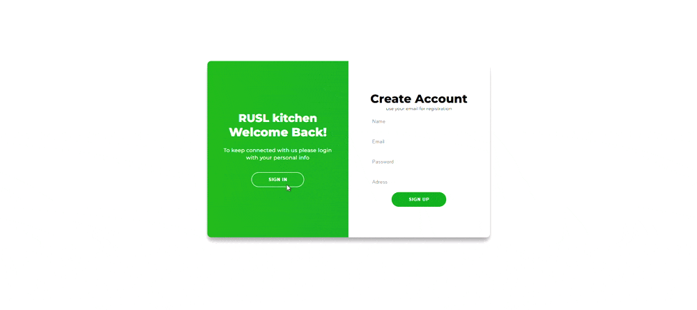

# 🚀 University Project - Interactive UI with Parallax Scrolling & Dark Mode  

## 🎓 Rajarata University of Sri Lanka  
[📄 **View Full Project Proposal Here**](ICT1108-Group05-ProjectProposal.pdf) 
### 📌 About the Project  
This project showcases my front-end development skills, including:  
- 🌄 **Parallax Scrolling** for a smooth scrolling effect  
- 🌞🌙 **Dark Mode & Light Mode Toggle** (Click the sun icon to switch)  
- 🔑 **Login System** for authentication  

### 🛠️ Technologies Used  
- HTML, CSS, JavaScript  
- Parallax Scrolling with CSS & JS  
- Dark Mode with Local Storage  
- Basic Login System  

### 🎥 Project Demo  
  
  
 

### 🚀 Features  
✅ Smooth parallax scrolling effect  
✅ Interactive theme switcher (Light/Dark Mode)  
✅ Simple login authentication system  
✅ Fully responsive design  

### 🔥 How to Run  
1. Clone this repository:  
   ```bash
   git clone https://github.com/your-username/your-repo.git
